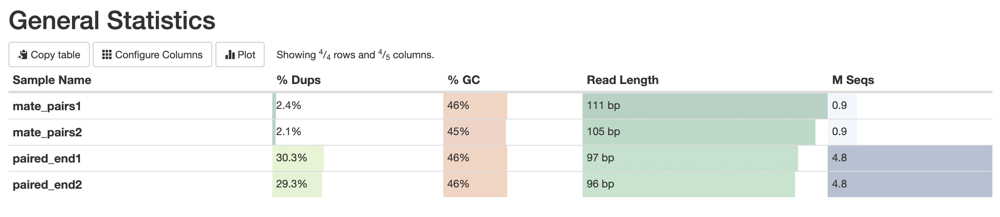

# hse22_hw1

Романова Анастасия, группа 2
# Основное задание
## Создание символических ссылок на каждый из файлов
``` 
ln -s /usr/share/data-minor-bioinf/assembly/oil_R1.fastq 
ln -s /usr/share/data-minor-bioinf/assembly/oil_R2.fastq 
ln -s /usr/share/data-minor-bioinf/assembly/oilMP_S4_L001_R1_001.fastq
ln -s /usr/share/data-minor-bioinf/assembly/oilMP_S4_L001_R2_001.fastq
```

## Выбор случайных чтений через ```seqtk``` и random seed = 603
```
seqtk sample -s 603 oil_R1.fastq 5000000 > paired_end1.fastq
seqtk sample -s 603 oil_R2.fastq 5000000 > paired_end2.fastq
seqtk sample -s 603 oilMP_S4_L001_R1_001.fastq 1500000 > mate_pairs1.fastq
seqtk sample -s 603 oilMP_S4_L001_R2_001.fastq 1500000 > mate_pairs2.fastq
```

## Оценка качества исходных чтений и получение по ним общей статистики с помощью программ ```fastqc``` и ```multiqc```
```
mkdir fastqc
mkdir multiqc

fastqc -o fastqc paired_end1.fastq
fastqc -o fastqc paired_end2.fastq
fastqc -o fastqc mate_pairs1.fastq
fastqc -o fastqc mate_pairs2.fastq

multiqc -o multiqc fastqc
```


## Подрезаем чтения по качеству с помощью platanus
```
platanus_trim paired_end*
platanus_internal_trim mate_pairs*
```

## Удаляем исходные чтения – файлы типа ```.fastq```, так как они больше не нужны
```
rm paired_end1.fastq paired_end2.fastq
rm mate_pairs1.fastq mate_pairs2.fastq
```

## Оценка качества подрезанных чтений и получение по ним общей статистики с помощью программ ```fastqc``` и ```multiqc```
```
mkdir fastqc_trimmed
mkdir multiqc_trimmed

fastqc -o fastqc_trimmed paired_end1.fastq.trimmed
fastqc -o fastqc_trimmed paired_end2.fastq.trimmed
fastqc -o fastqc_trimmed mate_pairs1.fastq.int_trimmed
fastqc -o fastqc_trimmed mate_pairs2.fastq.int_trimmed

multiqc -o multiqc_trimmed fastqc_trimmed
```




## Собираем контиги из подрезанных чтений с помощью программы ```platanus assemble```
```
time platanus assemble -o Poil -f paired_end1.fastq.trimmed paired_end2.fastq.trimmed 2> assemble.log
```

## Собираем скаффолды из контигов и подрезанных чтений с помощью программы ```platanus scaffold```
```
time platanus scaffold -o Poil -c Poil_contig.fa -IP1 paired_end1.fastq.trimmed paired_end2.fastq.trimmed -OP2 mate_pairs1.fastq.int_trimmed mate_pairs2.fastq.int_trimmed 2> scaffold.log
```

## Уменьшаем число гэпов с помощью подрезанных чтений с помощью программы ```platanus gap_close```
```
time platanus gap_close -o Poil -c Poil_scaffold.fa -IP1 paired_end1.fastq.trimmed paired_end2.fastq.trimmed -OP2 mate_pairs1.fastq.int_trimmed mate_pairs2.fastq.int_trimmed 2> gapclose.log
```

## Удаляем обрезанные чтения – файлы типа ```.fastq.trimmed``` и ```.fastq.int_trimmed```, так как они больше не нужны
```
rm paired_end1.fastq.trimmed paired_end2.fastq.trimmed
rm mate_pairs1.fastq.int_trimmed mate_pairs2.fastq.int_trimmed
```

## Переносим на локальный компьютер необходимые файлы, чтобы выложить на github, с помощью ```scp```
```
scp -P 5222 aaromanova_10@92.242.58.92:~/multiqc/multiqc_report.html ~/multiqc_untrimmed.html
scp -P 5222 aaromanova_10@92.242.58.92:~/multiqc_trimmed/multiqc_report.html ~/multiqc_trimmed.html

scp -P 5222 aaromanova_10@92.242.58.92:~/assemble.log ~/hse22_hw1/logs/assemble.log
scp -P 5222 aaromanova_10@92.242.58.92:~/scaffold.log ~/hse22_hw1/logs/scaffold.log
scp -P 5222 aaromanova_10@92.242.58.92:~/gapclose.log ~/hse22_hw1/logs/gapclose.log

scp -P 5222 aaromanova_10@92.242.58.92:~/Poil_contig.fa ~/hse22_hw1/data/Poil_contig.fa
scp -P 5222 aaromanova_10@92.242.58.92:~/Poil_scaffold.fa ~/hse22_hw1/data/Poil_scaffold.fa
scp -P 5222 aaromanova_10@92.242.58.92:~/Poil_gapClosed.fa ~/hse22_hw1/data/Poil_gapClosed.fa

scp -P 5222 aaromanova_10@92.242.58.92:~/Poil_contigBubble.fa ~/hse22_hw1/other/Poil_contigBubble.fa
scp -P 5222 aaromanova_10@92.242.58.92:~/Poil_scaffoldBubble.fa ~/hse22_hw1/other/Poil_scaffoldBubble.fa
scp -P 5222 aaromanova_10@92.242.58.92:~/Poil_32merFrq.tsv ~/hse22_hw1/other/Poil_32merFrq.tsv
scp -P 5222 aaromanova_10@92.242.58.92:~/Poil_lib1_insFreq.tsv ~/hse22_hw1/other/Poil_lib1_insFreq.tsv
scp -P 5222 aaromanova_10@92.242.58.92:~/Poil_lib2_insFreq.tsv ~/hse22_hw1/other/Poil_lib2_insFreq.tsv
scp -P 5222 aaromanova_10@92.242.58.92:~/Poil_scaffoldComponent.tsv ~/hse22_hw1/other/Poil_scaffoldComponent.tsv
```

## Анализ данных в notebook

Функция для загрузки данных из файла
```
def load_info(filename):
    data = ''
    with open(filename, 'r') as file:
        data = file.read()
    
    ''' Перед контигом / скаффолдом идет строка вида '>.+', поэтому делаю split по этому выражению '''
    
    data = re.split('>.+', data)
    splited_data = list(map(lambda i: i.replace('\n', ''), data))
    
    while '' in splited_data:
        splited_data.remove('')
    return splited_data
```

Функция для получения информации после анализа контигов / скаффолдов
```
def get_info(data):
    total_length, max_length, max_data = 0, 0, ''
    lengths = list()
    for i in data:
        length = len(i)
        total_length += length
        lengths.append(length)
        if length > max_length:
            max_length = length
            max_data = i
            
    total_cnt = len(data)

    lengths.sort()
    sum_len, n50 = 0, lengths[0]
    for length in lengths:
        sum_len += length
        if total_length <= 2 * sum_len:
            n50 = length
            break
    
    print(f'Количество: {total_cnt}')
    print(f'Длина: {total_length}')
    print(f'Максимальная длина: {max_length}')
    print(f'N50: {n50}')
    return max_data
```

Функция для получения информации о гэпах
```
def get_gap_info(scaffolds):
    max_length_scaffold = scaffolds[0]
    for current_scaffold in scaffolds:
        if len(current_scaffold) > len(max_length_scaffold):
            max_length_scaffold = current_scaffold
    
    gaps = re.findall('N+', max_length_scaffold)
    total_length = sum([len(i) for i in gaps])
    print(f'Количество гэпов в скаффолде максимальной длины: {len(gaps)}')
    print(f'Общая длина гэпов: {total_length}')
    return max_length_scaffold
```

## Результаты анализа контигов, скаффолдов и гэпов
```
Анализ полученных контигов
Количество: 620
Длина: 3926044
Максимальная длина: 158930
N50: 49854
```

```
Анализ полученных скаффолдов
Количество: 70
Длина: 3876216
Максимальная длина: 3832138
N50: 3832138
```

```
Анализ самого длинного скаффолда до уменьшения количества гэпов
Количество гэпов в скаффолде максимальной длины: 61
Общая длина гэпов: 7642

Анализ самого длинного скаффолда после уменьшения количества гэпов
Количество гэпов в скаффолде максимальной длины: 10
Общая длина гэпов: 3136
```

# Бонусное задание

## Повторяем все описанное выше, но изменяем порядок у числа случайных чтений (на один меньше)
```
seqtk sample -s 603 oil_R1.fastq 500000 > paired_end1.fastq
seqtk sample -s 603 oil_R2.fastq 500000 > paired_end2.fastq
seqtk sample -s 603 oilMP_S4_L001_R1_001.fastq 150000 > mate_pairs1.fastq
seqtk sample -s 603 oilMP_S4_L001_R2_001.fastq 150000 > mate_pairs2.fastq
```

## В папку ```bonus``` вытаскиваем только нужные для анализа файлы
```
scp -P 5222 aaromanova_10@92.242.58.92:~/Poil_contig.fa ~/hse22_hw1/bonus/Poil_contig.fa
scp -P 5222 aaromanova_10@92.242.58.92:~/Poil_scaffold.fa ~/hse22_hw1/bonus/Poil_scaffold.fa
scp -P 5222 aaromanova_10@92.242.58.92:~/Poil_gapClosed.fa ~/hse22_hw1/bonus/Poil_gapClosed.fa
```

## Результаты анализа контигов, скаффолдов и гэпов (используем те же функции, что и в основном задании)
```
Анализ полученных контигов
Количество: 3453
Длина: 3917192
Максимальная длина: 20373
N50: 3898
```

```
Анализ полученных скаффолдов
Количество: 461
Длина: 3862082
Максимальная длина: 814747
N50: 569414
```

```
Анализ самого длинного скаффолда до уменьшения количества гэпов
Количество гэпов в скаффолде максимальной длины: 321
Общая длина гэпов: 14848

Анализ самого длинного скаффолда после уменьшения количества гэпов
Количество гэпов в скаффолде максимальной длины: 26
Общая длина гэпов: 6612
```
